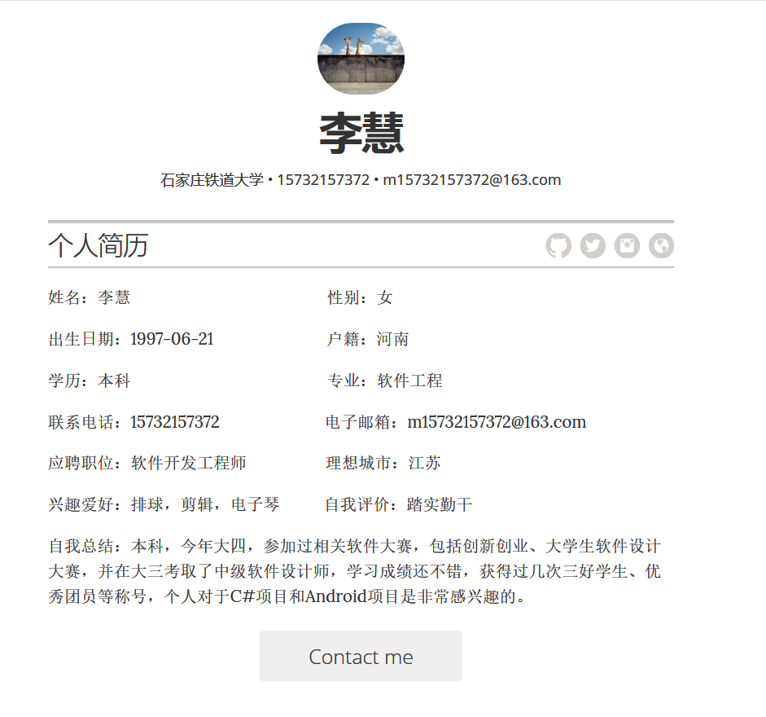

# 李慧的个人主页 :wink:

*A simple Jekyll + GitHub Pages powered resume template.*

## 介绍

### 主要内容

1. 个人简历
1. 自我介绍的视频播放
2. 学习情况
3. 社会活动情况
4. 专业实践情况
5. 相关链接： `博客园`， `github`

### 相关链接

1. 博客园：[https://github.com/Rebecca3150/](https://github.com/Rebecca3150/) 
2. github: [https://www.cnblogs.com/xiaxiaoshu/](https://www.cnblogs.com/xiaxiaoshu/) 

